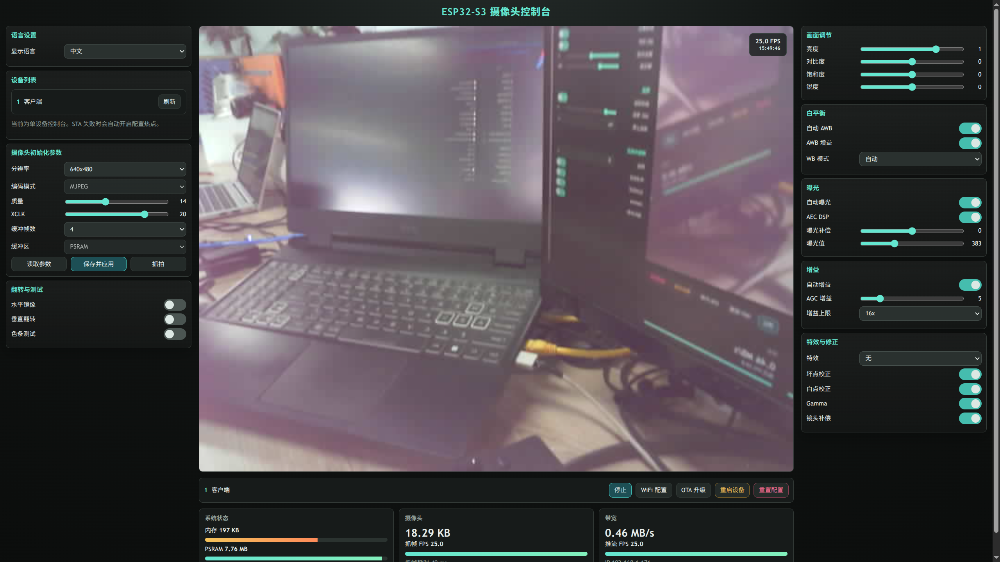

# ESP32-S3 Camera Web Server with OLED Telemetry & High FPS Performance Tuning

An advanced, lightweight, and high-performance ESP32-S3 camera web server firmware built using **PlatformIO** and **ESP-IDF 6.0**. This project integrates a physical `0.96-inch SSD1306 I2C OLED screen` for real-time telemetry, achieves fluid `25-30 FPS` video streaming, boots concurrently in under `100ms`, and features a stunning, single-page frosted-glass web console with dynamic resolution scaling.

---

## 🌟 Core Features & Tech Stack

### 1. Zero-Conflict I2C Master Driver & OLED Display
*   **ESP-IDF 6.0 New Master Driver API**: Developed utilizing the brand-new official `driver/i2c_master.h` driver, completely avoiding deprecated legacy I2C calls.
*   **Dual Hardware Bus Isolation**: Configured the secondary hardware I2C port (**`I2C_NUM_0`**) mapped to `GPIO 1` (SDA) and `GPIO 2` (SCL). This isolates the OLED screen from the `esp32-camera` core driver which registers internally on **`I2C_NUM_1`**, resolving hardware resource allocation conflicts and eliminating bootloader aborts.
*   **FreeRTOS Telemetry Thread**: A background thread running every 1 second queries system status and prints real-time telemetry to the physical OLED screen:
    1.  **Title Header**: `= ESP32-S3 CAM =`
    2.  **Network Telemetry**: Current connected Wi-Fi Station IP or fallback Access Point SSID.
    3.  **Stream Telemetry**: Real-time streaming FPS and active client counts.
    4.  **Hardware Resources**: Remaining internal DRAM heap size (in KB) and external PSRAM size (in MB).

### 2. High Frame-Rate Video Stream Tuning (25 - 30 FPS)
*   **Doubled Camera XCLK Clock (20MHz)**: Camera main clock frequency upgraded from the sluggish default of 10MHz to **20MHz**, doubling the physical capture limit of the OV2640 sensor.
*   **NVS Auto-Upgrade Mechanism**: Implemented a NVS non-volatile storage migrator that automatically upgrades any older `10MHz` configurations saved in flash to `20MHz` on bootup, ensuring plug-and-play high performance.
*   **Zero-Latency WiFi Configuration (`WIFI_PS_NONE`)**: Disabled the automatic WiFi sleep intervals (which normally introduce a heavy 50ms+ block per packet) to keep the radio continuously active, achieving maximum network throughput for real-time MJPEG frames.
*   **Downgraded Serial Logging**: Moved high-frequency per-frame stream logs in `app_httpd.cpp` from `ESP_LOGI` to `ESP_LOGD`, completely removing UART TX blocking bottlenecks.

### 3. Instant Asynchronous Boot Sequence (Instant Boot)
*   **Non-Blocking WiFi Setup**: Eliminated the blocking event synchronization waits in `wifi_init`. WiFi connection negotiations now run silently in the background.
*   **Under-100ms Server Ready**: The camera sensor, FreeRTOS display thread, and HTTP socket servers boot concurrently in less than 100 milliseconds from power-on. The web server listens immediately and is ready to stream the absolute millisecond the WiFi connects.
*   **Asynchronous AP Fallback**: Retries are handled in the background. If the station connection fails, it launches a configuration Access Point hotspot dynamically without halting other system processes.

### 4. Premium Responsive Single-Page Web Dashboard
*   **Viewport Lock Design**: Redesigned style system fitting perfectly on a single screen without vertical scrolling. Config sidebars feature independent micro-scrollbars.
*   **Dynamic Viewport Sizing Engine**: A client-side JavaScript engine dynamically resizes the video player viewport depending on the chosen resolution (smaller for VGA, larger for UXGA) and adapts its aspect ratio (16:9 for HD, 4:3 for VGA, 5:4 for SXGA) to completely eliminate black padding bars.
*   **Fluid Cubic-Bezier Transitions**: Viewport resizing shifts smoothly with beautiful CSS keyframe transition animations.
*   **Frosted-Glass (Glassmorphism) Aesthetics**: Premium dark/teal aesthetic utilizing frosted panels (`backdrop-filter: blur(12px)`), neon indicators, and micro-interactions.
*   **CPU & Native Temperature Sensors**: Restored board telemetry displaying dynamic dual-core CPU utilization (Core 0 system/WiFi, Core 1 MJPEG processing) and actual Celsius chip temperatures.

### Web Console Preview


---

## 🔌 Hardware Connections & Wiring

Target Board: **Freenove ESP32-S3 WROOM/CAM** (using the `CAMERA_MODEL_ESP32S3_EYE` pin layout) with 8MB external PSRAM.

### OLED I2C Screen Connection:
| OLED PIN | ESP32-S3 GPIO PIN | Description |
| :--- | :--- | :--- |
| **GND** | **GND** | Common Ground |
| **VCC** | **3.3V (3V3)** | Power Supply (Ensure 3.3V logic to protect I2C pins) |
| **SDA** | **GPIO 1** | I2C Data Line (Hardware `I2C_NUM_0`) |
| **SCL** | **GPIO 2** | I2C Clock Line (Hardware `I2C_NUM_0`) |

---

## 🛠️ Compilation & Flashing Guide

This project is built using the **PlatformIO Core CLI** or VS Code PlatformIO extension with ESP-IDF framework.

### 1. Package Web Resources (Optional)
If you modify the web resources in `web/index.html`, you must package it into a compressed C-header file:
```bash
python3 scripts/generate_camera_index.py
```
This script automatically compresses the HTML page using Gzip and writes the static array to `src/camera_index.h`.

### 2. Compile Code
Build the firmware binaries:
```bash
pio run
```

### 3. Flash to ESP32-S3
Upload the built firmware directly to your target board via USB-to-UART (e.g. `/dev/ttyACM0`):
```bash
pio run -t upload
```

---

## 📂 Project Directory Structure

```text
camera-webserver/
├── .gitignore              # Git filter lists
├── platformio.ini          # PlatformIO board & environment definitions
├── partitions.csv          # Partition sizes
├── scripts/
│   └── generate_camera_index.py  # Gzip packager for index.html
├── web/
│   └── index.html          # Web dashboard source (Teal Glassmorphism UI)
├── src/
│   ├── main.cpp            # Main firmware logic, WiFi setup, OLED thread
│   ├── app_httpd.cpp       # Camera HTTP Server, MJPEG streaming, Metrics API
│   ├── ssd1306.h           # Lightweight new ESP-IDF 6.0 I2C master OLED driver
│   ├── app_state.h         # App structs and definitions
│   ├── camera_pins.h       # Freenove Camera model GPIO map
│   └── camera_index.h      # Auto-generated Gzipped HTML header array
└── README.md               # This documentation
```

---

## 👨‍💻 Author
Developed and maintained by [limumu1997](mailto:limumu1997@live.com).
